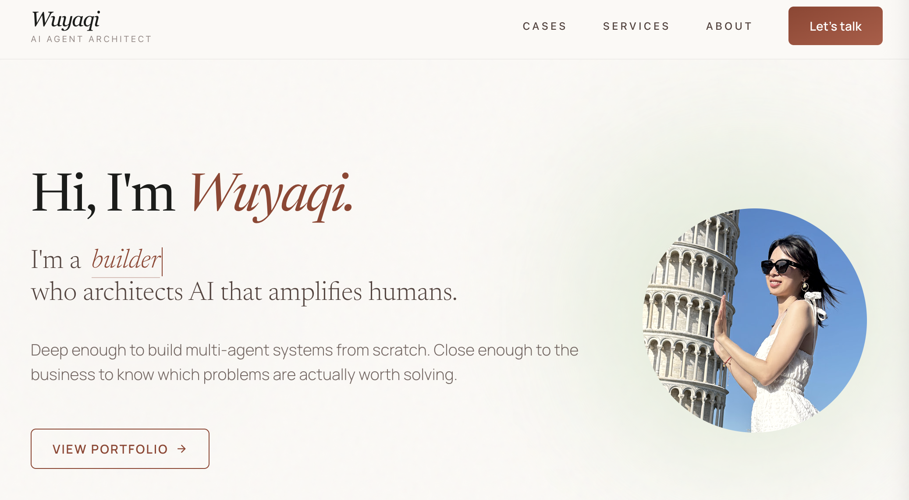

[English](#english) · [中文](#中文)

---

## English

# Wuyaqi Yin — AI Agent Architect

> Click the image to visit the live site →

This website was built entirely with AI — every line of code, every design decision, every iteration. No traditional development workflow. No hand-written boilerplate.

AI didn't replace my judgment. It amplified it. I brought the vision, the aesthetic, the standards. Claude turned them into running code — pixel by pixel, component by component. The result is a site that reflects exactly what I believe about AI:

**It should disappear into the way you already work — and make what you're capable of, bigger.**

I believe everyone deserves access to that kind of amplification. That's the work I do.

---

### What's inside

| Path | Contents |
|------|----------|
| `index.html` | Main site — all sections |
| `design_ethos/` | Full design system — The Digital Atelier |
| `1.hero` `2.cases` `3.services` `4.philosophy` `5.contact` | Per-section iteration files |

**Stack:** HTML · Tailwind CSS · Newsreader + Manrope · Material Symbols

---

## 中文

# Wuyaqi — AI Agent 架构师

> 点击图片直接进入网站 →

这个网站从头到尾由 AI 构建——每一行代码、每一个设计决策、每一次迭代，全部是人机协作的成果。没有传统开发流程，没有手写样板代码。

AI 没有取代我的判断，而是放大了它。我带来的是想法、审美和标准，Claude 把它们变成了可以运行的代码——逐像素，逐组件。这个网站本身，就是我对 AI 的理解的一次实践：

**AI 应该消失进你原有的工作方式里，让你能做到的事情，变得更大。**

我相信每个人都应该享受到这种放大能力。这正是我在做的事。

---

### 目录结构

| 路径 | 内容 |
|------|------|
| `index.html` | 完整网站——所有 section |
| `design_ethos/` | 完整设计系统——The Digital Atelier |
| `1.hero` `2.cases` `3.services` `4.philosophy` `5.contact` | 各 section 的迭代文件 |

**技术栈：** HTML · Tailwind CSS · Newsreader + Manrope · Material Symbols
